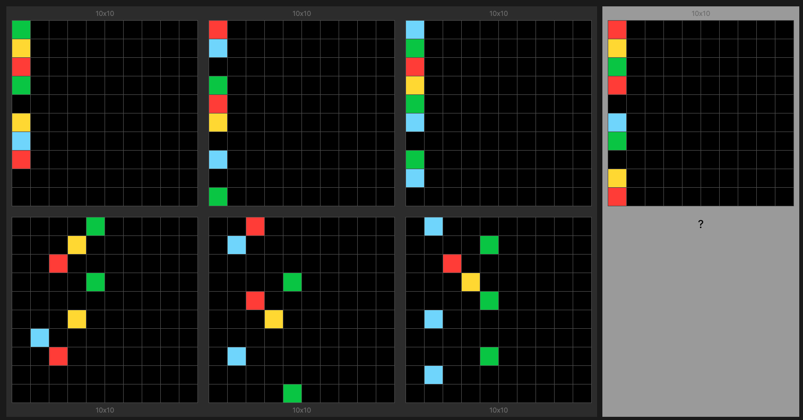

# README

## Current Status

- Background knowledge is incomplete.
- Metrics for the full dataset are not yet available; the approach has been tested only on selected examples to demonstrate the concept.

## Motivation

This repository implements a prototype to address the [ARC-AGI challenge](https://arcprize.org/arc) using **Inductive Logic Programming (ILP)** methods [[ILP Introduction]](https://arxiv.org/abs/2008.07912) [[Wiki]](https://en.wikipedia.org/wiki/Inductive_logic_programming). The goal of **ILP** is to generate *logical rules* that describe a given dataset. For example, in the [task](https://neoneye.github.io/arc/edit.html?dataset=ARC&task=f45f5ca7) shown in Figure 1, the following rules can be learned:

```prolog
output('green', X, Y) :-                                  % If there is a green input with X and Y=D+4
   input('green', X, D), plus1func(D, E), plus3func(E, Y). % then there is a green output with X and updated Y
output('blue', X, Y) :-
   input('blue', X, D), plus1func(D, Y).
output('yellow', X, Y) :-
   input('yellow', X, D), plus3func(D, Y).
output('red', X, Y) :-
   input('red', X, D), plus2func(D, Y).
```

<p align="center"><em>Listing 1. Example of generated rules.</em></p>

Before applying the induction algorithm, the raw data must first be converted into objects (e.g., `input` and `output` in *Listing 1*). The representation of the raw data is not predetermined. For example, in the task shown in Figure 1, we can extract ***lines*** from the input instead of ***individual pixels***. If the induction process attempts to describe how to convert lines to pixels, it can lead to undesirable outcomes and failure. Thus, we require flexibility in the choice of representations.

<div align="center">

<p><em>Figure 1. Task: "Move pixels right".</em></p>
</div>
<em>* Task images are sourced from <a href="https://neoneye.github.io/arc/" style="font-size: 13px">https://neoneye.github.io/arc</a>.</em>

### Objectives

To achieve the desired outcomes, the following steps are outlined:

1. Develop top-down and bottom-up operators to iteratively extract appropriate objects.
2. Evaluate these representations with heuristics to identify the most promising ones.
3. Once a representation is chosen, perform fast induction and theory/program search.
4. Use only relevant background knowledge based on the chosen representations.
5. Configure language bias for every induction maximally reducing search space.

To build further intuition, let us consider another [task](https://neoneye.github.io/arc/edit.html?dataset=ARC&task=00d62c1b) (Figure 2).

<div align="center">

<p><em>Figure 2. Task: "Fill yellow".</em></p>
</div>

The answers for this task can be expressed in natural language as:

- "Fill holes in green figures with yellow color."
- "Recolor all rectangular black figures to yellow."

In this case, the 'pixel' representation from the previous task is no longer necessary. For the first answer, we only require green complex figures and need to check for holes. For the second answer, we only need black figures and need to check for rectangularness. While a pixel-level answer is possible, it introduces redundant relationships that significantly increase the induction search space (e.g., for pixel representation: "If a pixel is part of a rectangular black figure, then recolor the pixel to green"; for object representation: "If a figure is rectangular, then recolor it to yellow").


The most relevant papers tackling ARC-AGI challenge with **ILP** are:
1. Program Synthesis using Inductive Logic Programming for the Abstraction and Reasoning Corpus. [arXiv:2405.06399](https://arxiv.org/abs/2405.06399)
2. Relational decomposition for program synthesis. [arXiv:2408.12212](https://arxiv.org/abs/2408.12212)

## Algorithm

The core algorithm focuses on extracting multiple representations of inputs and outputs in a top-down fashion to facilitate program induction. Representations are ranked by calculating distances between inputs and outputs, with the most promising representations selected for induction. The induction process uses the [Aleph](https://www.cs.ox.ac.uk/activities/programinduction/Aleph/aleph.html) system written in `Prolog`, supplemented by primitive `Python` solvers capable of identifying one-to-one and constant relationships. Planned enhancements include integrating additional induction systems and neuro-symbolic methods.

## Basic Usage

### Running the Prototype

#### Single File
```bash
python main.py -f ./data/arc/evaluation/f45f5ca7.json -l debug
```

#### Multiple Files
```bash
python main.py -d ./data/arc/evaluation/ ./data/arc/training/
```

#### Parallel Execution
```bash
python main.py -p 8 -d ./data/arc/evaluation/
```

## TODO

- Collect metrics for the full dataset.
- Develop a robust distance function.
- Implement background knowledge ranking.
- Add classification as a special case of induction (??).
- Introduce configurable pipelines with standardized (e.g., sklearn-like) interfaces.
- Add bottom-up and other extraction methods, list-like representations.
- Replace `Python` validations with induction constraints wherever possible. (??)
- Research the `table/1` predicate for data access (see [example](https://github.com/friguzzi/aleph/blob/master/prolog/examples/weather.pl)).
- Introduce neuro-symbolic methods.