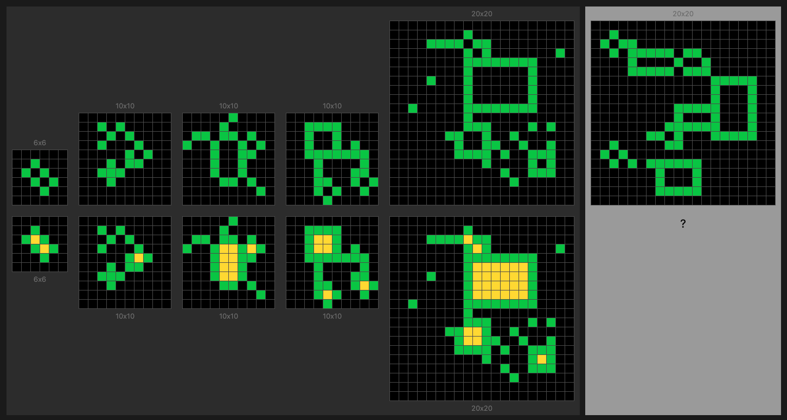

# Multi Representation Inductive Solver

## Motivation

This repository implements a *prototype* to address the [ARC-AGI challenge](https://arcprize.org/arc) using *Inductive Logic Programming (ILP)* methods [[ILP Introduction]](https://arxiv.org/abs/2008.07912) [[Wiki]](https://en.wikipedia.org/wiki/Inductive_logic_programming) and ideas rooted in common human biases.

One of the goals of ILP is to generate *logical rules* that describe data using sound procedures with guarantees, even with a small number of examples. For example, in the task "Move pixels right" shown in *Figure 1*, the following rules can be learned:

```prolog
output('green', X, Y) :-                                  % If there is a green input with X and Y=D+4
   input('green', X, D), plus1func(D, E), plus3func(E, Y). % then there is a green output with X and updated Y
output('blue', X, Y) :-
   input('blue', X, D), plus1func(D, Y).
output('yellow', X, Y) :-
   input('yellow', X, D), plus3func(D, Y).
output('red', X, Y) :-
   input('red', X, D), plus2func(D, Y).
```

<p align="center"><em>Listing 1. Example of generated rules.</em></p>

However, before applying the induction algorithm, raw data must first be converted into objects (e.g., `input` and `output` in *Listing 1*), and it is unknown how to transform data in advance for the ARC tasks. For example, in the task shown in *Figure 1*, if we apply *connectivity*, we can extract *lines* from the input instead of individual *pixels*. If the induction process attempts to describe how to convert lines to pixels (lines in input, pixels in output), it can fail. Thus, we require flexibility in the choice of representations.

<div align="center">

<p><em>Figure 1. Task: "Move pixels right".</em></p></div>
<em style="font-size: 10px" align="left">* Task images are sourced from <a href="https://neoneye.github.io/arc/">https://neoneye.github.io/arc</a></em>

To build further intuition, let us consider another task (*Figure 2*).

<div align="center">

<p><em>Figure 2. Task: "Fill yellow".</em></p>
</div>

The answers for this task can be expressed in natural language as:

- "Fill holes in green figures with yellow color."
- "Recolor all rectangular black figures to yellow."

In this case, the *pixel* representation from the previous task is no longer necessary. For the first answer, we only require green objects and need to check for holes. For the second answer, we only need black objects and assess rectangularness. While a pixel-level answer is possible, it introduces redundant relationships that significantly increase the induction space. For example, for pixel representation, the answer could be: "If a pixel is part of a rectangular black figure, then recolor the pixel to green." For object representation: "If a figure is rectangular, then recolor it to yellow." It is obvious that the latter answer will be shorter in formal language (the task can even be translated to classification problem).

The ideas described above follow from logic behind ***human common reasoning capabilities*** as well as assumptions about ***joint distribution of representations and inductions***, namely:
  - The count of objects participating in the induction process should be small.
  - If the answer involves sequential steps and memorization, the count of steps should be small.
  - Sequential programs should be easily parameterized (e.g., *extend line to the right until the border*).
  - Unification of objects should be fast (due to human visual perception).
  - The description length of the answer in natural language has to be shorter.
  - The entire process of finding the answer is non-monotonic.
  - Induction should be fast.

and other human biases.

The most relevant papers tackling the ARC-AGI challenge with ILP are:
1. **Program Synthesis using Inductive Logic Programming for the Abstraction and Reasoning Corpus**. [arXiv:2405.06399](https://arxiv.org/abs/2405.06399)
   - Implements ILP techniques tailored to ARC tasks, focusing on logical rule synthesis.
   - Based on the **FOIL** induction system.
2. **Relational decomposition for program synthesis**. [arXiv:2408.12212](https://arxiv.org/abs/2408.12212)
   - Proposes methods for decomposing relational structures to improve program synthesis.
   - The decomposition method (*Listing 1*) presented here is inspired by this paper.
   - Based on the **Popper** induction system ([link](https://github.com/logic-and-learning-lab/Popper/)).

## Algorithm

The core algorithm focuses on sequentially extracting multiple representations of inputs and outputs in a top-down fashion to facilitate program induction. Representations are ranked by calculating symbolic distances between inputs and outputs, with the most promising representations selected for further induction. These distances may include geometric, symbolic, or informational metrics to evaluate representation suitability (e.g., RIBL, edit-distance, compression level, etc.). The induction process uses the universal ILP system [Aleph](https://www.cs.ox.ac.uk/activities/programinduction/Aleph/aleph.html) written in `Prolog`, supplemented by primitive `Python` solvers capable of identifying one-to-one and constant relationships. Planned enhancements include integrating additional induction systems and neuro-symbolic methods or reinforcement learning.

### Main Algorithm (Roughly)
1. Extract representations in a top-down fashion.
2. Calculate distances between inputs and outputs.
3. Add representations and distances to a queue.
4. Choose the nearest representations from the queue.
5. Perform induction with chosen representations.
6. If induction fails due to timeout or disagreement with requirements, return to step 1.

### Induction Algorithm (Roughly)
1. Take background knowledge relevant to representations.
2. Configure language bias to maximally reduce the search space.
3. Generate negative examples.
4. Start induction.

## Basic Usage

### Running the Prototype

#### Single File
```bash
python main.py -f ./data/arc/evaluation/f45f5ca7.json -l debug
```

#### Multiple Files
```bash
python main.py -d ./data/arc/evaluation/ ./data/arc/training/
```

#### Parallel Execution
```bash
python main.py -p 8 -d ./data/arc/evaluation/
```
### These Examples Should Work

```bash
python main.py -f ./data/arc/evaluation/f45f5ca7.json -l debug
python main.py -f ./data/arc/training/4258a5f9.json -l info
```

This is just a prototype, so there is still a lot to be done(TODO):

- Collect metrics for the full dataset.
- Develop a robust distance function.
- Implement background knowledge ranking.
- Add classification as a special case of program induction.
- Introduce configurable pipelines with standardized (e.g., sklearn) interfaces.
- Add bottom-up and other extraction methods, list-like representations, and input-output mutually dependent representations.
- Replace `Python` validations with induction constraints wherever possible.
- Research the `table/1` predicate for data access (see [example](https://github.com/friguzzi/aleph/blob/master/prolog/examples/weather.pl)).
- Introduce neuro-symbolic methods.


